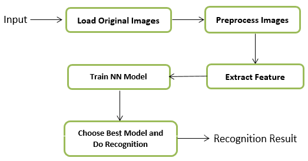
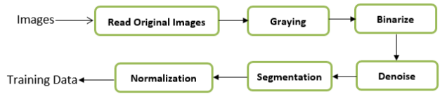

In this project, we generate a Chinese ID Card database containing 481 images and use neural network to train a pattern recognition model using Matlab. 

We use neural network to recognize ID card information. 

This process of Chinese ID Cards Recognition System mainly contains five steps.
* Load Images
* Preprocess Images
* Extract Feature
* Train the Neural Network Model
* Choose Best Model to Do Recognition
The main workflow is shown in figure:

For our program, the image preprocessing contains four steps. The figure below shows the flow chart of image preprocessing.

